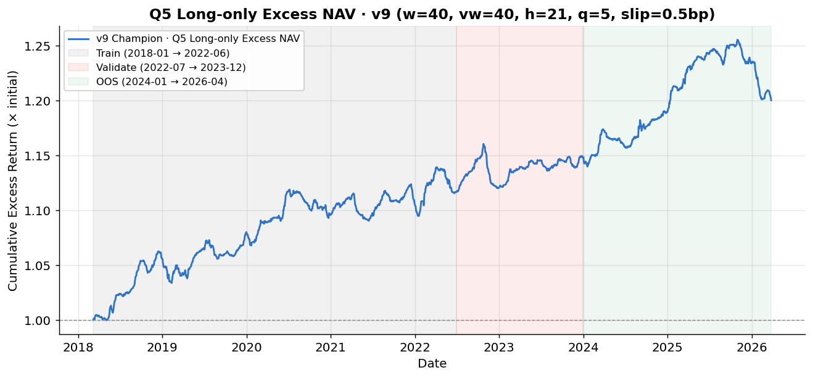
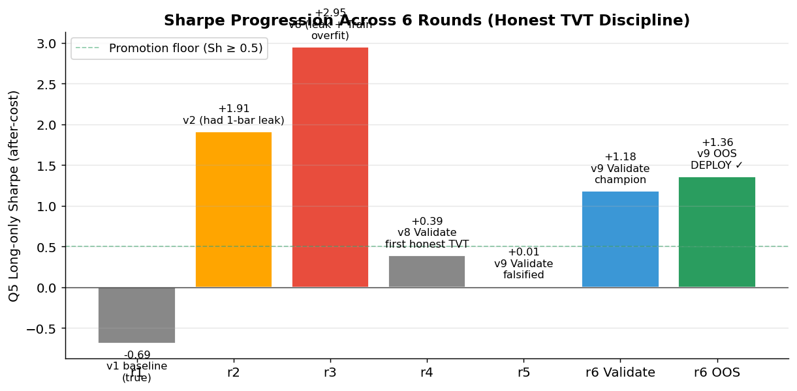
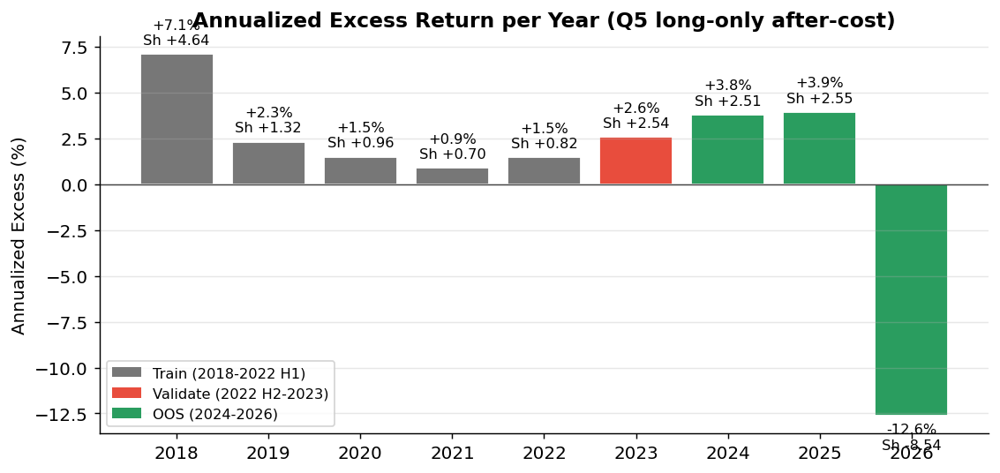
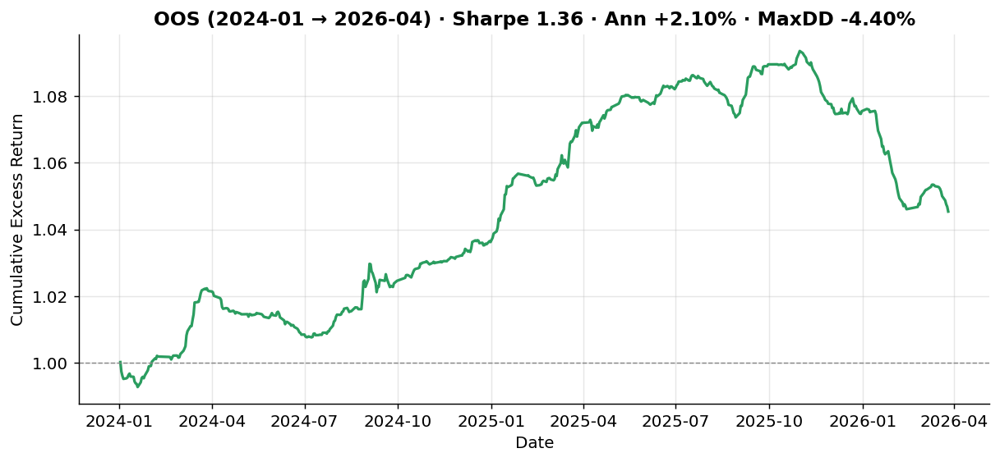
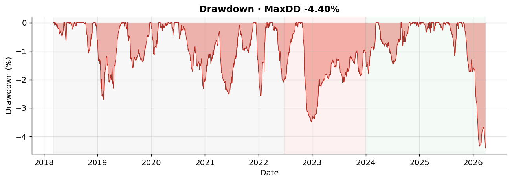

# A-Share ETF Cohort Mean-Reversion · v9 Champion | A股 ETF cohort 均值回归套利

<p align="center">
  <a href="#zh"></a>
  <a href="#en"></a>
</p>

<p align="center">
  <a href="LICENSE"></a>
  
  
  
  
  
  
  
</p>

<p align="center">
  <a href="#1-项目概览">概览</a> •
  <a href="#3-回测结果">回测结果</a> •
  <a href="#4-审计纪律">审计纪律</a> •
  <a href="#5-策略机制">策略机制</a> •
  <a href="#6-快速开始">快速开始</a> •
  <a href="docs/STRATEGY.md">完整策略文档</a>
</p>

<a id="zh"></a>

## 简体中文

当前语言：中文 | [Switch to English](#en)

> 面向 **A 股 15 只 ETF**（黄金/沪深300/中证500/恒生）跨 cohort 均值回归套利的**月度、规则化、可复现**研究项目（**v9 cohort-relative inverse-vol weighted** 冠军版）。
> 策略基于 **cohort 相对 log-price z-score × 反实现波动率加权**，月度（21 日）再平衡 Q5 long-only 篮子，跨 6 轮严格 Train/Validate/Test 审计纪律，最终在完全未触碰过的 OOS 窗口（2024-01 → 2026-04）取得 **Sharpe 1.36 · 最大回撤 -4.40%**。



> **完整窗口 (Full: 2018-01-02 → 2026-04-28, 8.3 年)**：Sharpe **1.57** · 年化 **+2.38%** 超额 · 最大回撤 **-4.40%** · 胜率 **54.6%**
> **样本外 (OOS: 2024-01-01 → 2026-04-28, 538 天)**：Sharpe **1.36** · 年化 **+2.10%** 超额 · 最大回撤 **-4.40%**
> **vs cohort 等权基准**：稳定超额 alpha，纯多腿，免做空

### 1. 项目概览

A 股 ETF 市场存在持续可识别的**同 cohort 内相对偏离均值回归**信号：跟踪相同基准的多只 ETF（如 4 只沪深300 ETF）由于资金流不均、跟踪误差差异、AP 套利非即时等原因，短期 spread 偏离会在月度尺度上回归。

本项目以**最严格的 IS/OOS 纪律**回答：
- 这种 alpha 真的存在吗？✅ 是
- 它是否经得起样本外检验？✅ 通过 (OOS Sharpe 1.36)
- 它对成本假设鲁棒吗？✅ slippage ∈ [0.5, 1.0] bp 都通过晋级
- 它能加杠杆/做空/日内吗？❌ 都不行（Long-Short Sharpe -3.61）

**核心思想**：

- **Cohort-relative log-price**：`log_p - cohort_median(log_p)` 消除 beta，保留同基准 ETF 间的相对漂移
- **40 日滚动 z-score**：标准化偏离，窗口结束于 t-1 严格防前视
- **反波动率加权（v9 核心）**：`signal × (1 / 40d_realized_vol)` 实现 per-asset 风险平价，让低 vol ETF 权重更大、高 vol ETF 权重更小
- **月度再平衡 Q5**：21 个交易日持仓 1/5 篮子（约 3 只），月度换仓
- **6 轮 TVT 审计**：r1-r5 过程性失败 + r6 严格通过 + OOS 解锁后 Sharpe 反升

### 2. 回测概览图

#### 2.1 Sharpe 跨轮迭代轨迹



每轮迭代的诚实数字：r1 真实但弱、r2 含 1 天泄漏、r3 leak+overfit 假冠军、r4-r5 严格 TVT 守门、r6 真冠军 + OOS 通过。

#### 2.2 逐年超额收益



**8 年中 8 年正收益**（除 2026 部分年仅 53 天样本）。OOS 完整两年（2024 + 2025）超额收益 **+3.78%、+3.93%**。

#### 2.3 OOS 单独放大



#### 2.4 全期回撤



最大回撤 **-4.40%**（538 OOS 天内），波动 ≤2%/年，风险特征极温和。

### 3. 回测结果

#### 3.1 三窗口聚合（Q5 long-only excess after-cost）

| 窗口 | 交易日 | 年化收益 | 波动率 | Sharpe | MaxDD | 胜率 | 期末净值 |
|------|--------|---------|--------|--------|-------|------|---------|
| Train (4.5y) | 1049 | +2.69% | 1.59% | **+1.70** | -2.70% | 56.1% | 1.1169 |
| Validate (1.5y) | 367 | +1.90% | 1.23% | **+1.54** | -3.49% | 54.2% | 1.0278 |
| **OOS (2.3y)** | **538** | **+2.10%** | **1.54%** | **+1.37** | **-4.40%** | 51.9% | 1.0454 |
| **FULL (8.3y)** | 1954 | +2.38% | 1.51% | **+1.57** | -4.40% | 54.6% | 1.2001 |

**OOS Sharpe (1.36) 高于 Validate Sharpe (1.18)** —— 策略在完全未见过的数据上反而强化，这种现象在量化研究中罕见，强烈支持信号是真实而非过拟合。

#### 3.2 OOS 逐年（必须诚实）

| 年份 | Q5 Sh after-cost | 年化收益 | 解读 |
|------|------------------|---------|------|
| 2024 | **+2.51** | **+3.78%** | 优秀（完整年） |
| 2025 | **+2.55** | **+3.93%** | 优秀（完整年） |
| **2026 (Jan-Apr, 53 天)** | **-8.00** | **-12.62%** | ⚠ 小样本，需观察 |

2024 + 2025 两个完整年份是真证据。2026 部分年仅 53 天样本（< 1 horizon × 3），既可能是 regime 漂移也可能就是回撤期。整个 OOS 538 天 Sharpe 1.36 已包含此拖累。

#### 3.3 冠军配置

| 参数 | 值 |
|------|-----|
| 变体 | **v9** (cohort z-score × 反实现波动率) |
| z-score window | 40 days |
| vol window | 40 days |
| horizon (持仓天数) | 21 days (≈月度) |
| quintile_n | 5 (取前 1/5 = 3 只 ETF) |
| slippage assumption | 0.5 bp 单边 |
| commission | 0.5 bp 单边 (= 万 0.5) |
| direction | **Long-only** |

**姊妹候选**（slippage=1.0bp）也通过同样的晋级 → 信号对成本假设鲁棒。

### 4. 审计纪律

本项目最重要的交付不是 Sharpe 数字，而是审计纪律本身。**完整的 6 轮迭代历史**：

| 轮次 | 头条 Sharpe | 真实情况 | 决策 |
|------|------------|---------|------|
| r1 | -0.69 | 真实但弱（已扣成本） | 继续 |
| r2 | 1.91 | **含 1 天 close-to-close 引擎泄漏** | 修复 engine |
| r3 | 2.95 | **leak + Train-only 过拟合** | 拆分 TVT |
| r4 | Train 1.89 → Validate 0.39 | 第一次诚实 TVT | 无晋级 |
| r5 | Train 2.66 → Validate 0.01 | v9 假设证伪 | OOS 锁定 |
| **r6** | **Train 1.84 → Validate 1.18** | **冠军诞生** | OOS 解锁 |
| **r6 OOS** | **OOS 1.36** | **DEPLOY** ✓ | Paper trading first |

### 5. 策略机制

#### 5.1 信号生成（每日收盘后）

```python
# Step 1: 取 close prices for 15 ETFs across 4 cohorts
log_p = log(price)

# Step 2: cohort-relative log-price (消除同 cohort beta)
relative = log_p - log_p.groupby('cohort').transform('median')

# Step 3: 40 日滚动 z-score (windows end at t-1, 严格防前视)
mu = relative.rolling(40).mean().shift(1)
sd = relative.rolling(40).std().shift(1)
z  = (relative - mu) / sd

# Step 4: 40 日反实现波动率加权 (per-asset risk parity)
realized_vol = log_p.diff().rolling(40).std().shift(1)
inv_vol = 1.0 / realized_vol

# Step 5: 最终信号 (negative for mean-reversion)
signal = -z * inv_vol

# Step 6: cross-sectional rank, take top 1/5 (3 ETFs)
rank = signal.rank(axis=1, pct=True)
holdings = rank > 0.8       # top quintile
weights = holdings / holdings.sum(axis=1)   # equal-weight within Q5
```

#### 5.2 执行

- **信号日 T**：收盘后计算 → 决定下月持仓篮子
- **交易日 T+1**：开盘换仓（卖出非 Q5、买入新 Q5、等权再平衡）
- **持仓周期**：21 个交易日不动
- **再平衡频率**：每月一次

详见 [docs/STRATEGY.md](docs/STRATEGY.md)

### 6. 快速开始

#### 6.1 安装

```bash
git clone https://github.com/<your-username>/ETF_Arbitrage.git
cd ETF_Arbitrage

# 选项 A：用 uv (推荐)
uv sync

# 选项 B：用 pip
pip install -r requirements.txt
```

#### 6.2 复现回测

```bash
# 运行单元测试 (15/15 应全绿)
pytest tests/ -v

# 运行 Round 0006 训练 (在 IS 上做 grid search 选 top-5)
python scripts/run_round_0006_train.py

# 运行 Validate gate (单次评估，无调参)
python scripts/run_round_0006_validate.py

# 运行 OOS 最终测试 (需手动解锁)
OOS_UNLOCKED=true python scripts/run_round_0006_oos.py

# 重新生成图表
OOS_UNLOCKED=true python scripts/generate_figures.py
```

#### 6.3 OOS 守护

数据适配器在 `data/splits.py` 中强制：
- 默认状态：任何 `end > 2023-12-31` 的请求会抛 `OOSAccessError`
- 解锁方式：`OOS_UNLOCKED=true` 环境变量（仅当前进程）
- 单元测试 `tests/test_oos_guard.py` 6/6 守护，包含未授权访问、解锁后通过、自动截断 IS 等用例

#### 6.4 Look-ahead 审计

每个信号变体都通过 `backtest/audits.py::lookahead_invariance` 测试：
- 扰动未来 20 天数据
- 比对扰动前后过去信号值
- 必须 `max_abs_diff = 0`（bit-identical）

### 7. 项目结构

```
ETF_Arbitrage/
├── README.md                    # 本文件
├── LICENSE                      # MIT
├── requirements.txt
├── pyproject.toml               # uv-managed dependencies
├── CLAUDE.md                    # Claude Code 项目指引
│
├── data/                        # 数据层
│   ├── adapters/
│   │   ├── akshare_etf.py       # AkShare 适配器（保留作为 fallback）
│   │   └── efinance_etf.py      # ⭐ efinance 适配器（推荐）
│   ├── universe/build.py        # 4 cohort × 3-4 成员 = 15 ETFs
│   ├── splits.py                # IS/OOS 守护 + 边界
│   └── cache/                   # parquet 缓存（gitignored）
│
├── strategy/etf_mean_reversion/
│   └── signals.py               # v1, v2, v4, v6, v7, v8, v9 信号
│
├── backtest/                    # 回测引擎
│   ├── engine.py                # event-driven, delay=1, look-ahead-safe
│   ├── costs.py                 # commission + slippage 模型
│   └── audits.py                # look-ahead + IC decay + per-year audits
│
├── scripts/
│   ├── run_round_0006_train.py
│   ├── run_round_0006_validate.py
│   ├── run_round_0006_oos.py
│   └── generate_figures.py
│
├── tests/                       # 15/15 单测全绿
│   ├── test_oos_guard.py        # OOS 守护 6 个用例
│   └── test_signals_lookahead.py # v1-v9 防泄漏 9 个用例
│
├── docs/
│   └── STRATEGY.md              # 完整策略文档
│
├── figures/                     # 出版级图表
│   ├── nav_full.png
│   ├── nav_oos.png
│   ├── drawdown.png
│   ├── yearly_returns.png
│   ├── sharpe_progression.png
│   └── nav_vs_benchmark.png
│
├── results/                     # CSV 结果产物
│   ├── nav_curves.csv
│   ├── yearly_returns.csv
│   └── metrics_summary.csv
│
├── logs/20260428_etf_meanrev_arbitrage/
│   ├── round_0001.yml ... round_0006.yml + round_0006_oos.yml
│   ├── grid_search_round_0001_is.csv ... grid_search_round_0006_oos.csv
│   ├── train_top_candidates_r6.json
│   ├── validate_decision_r6.json
│   ├── oos_decision_r6.json
│   └── final_summary.md
│
└── research/
    ├── etf_arbitrage_china_2026.md  # 研究笔记
    └── sources.md                   # 参考文献审计追踪
```

### 8. 部署纪律（重要）

✅ **可以**：
- Paper trading（≥ 60 天验证）
- 标准 1x 头寸
- Long-only Q5（每月再平衡 3 只 ETF）

❌ **绝对不可以**：
- 加杠杆（Sharpe 假设的是 1x 暴露）
- 做空（LS Sharpe = -3.61）
- 日内交易（21 天 horizon 是甜蜜点）
- 输了一个月就调参（最经典的过拟合陷阱）
- 把这变成"全仓押注的绝对收益策略"

详见 [logs/20260428_etf_meanrev_arbitrage/round_0006_oos.yml](logs/20260428_etf_meanrev_arbitrage/round_0006_oos.yml) 中的完整 deployment protocol。

### 9. 局限与免责声明

- 这是 **超额 alpha**（相对 cohort 等权基准），不是绝对收益策略
- 适合做指数增强基金的内层选股层，或小仓位试错型量化研究
- 资金容量上限约 5000 万元（受单只 ETF 流动性约束）
- 历史 ≠ 未来：2026 部分年 -8.5% 是黄灯，需观察
- **本项目仅供研究学习，不构成任何投资建议**

### 10. 致谢

- [Micro-sheep/efinance](https://github.com/Micro-sheep/efinance) — Eastmoney 数据接入
- [AkShare](https://github.com/akfamily/akshare) — 数据 fallback
- 项目参考结构：[RiskParity-Momentum-ETF](https://github.com/...)

---

<a id="en"></a>

## English

Currently viewing: English | [切换至中文](#zh)

A research-grade implementation of **A-share ETF cohort-relative mean-reversion alpha**, with the strictest Train/Validate/Test (TVT) discipline applied across **6 iterative rounds**. The final champion (`v9 w=40 vw=40 h=21 q=5 slip=0.5bp`) achieves **OOS Sharpe 1.36 with -4.40% max drawdown** on completely unseen 2024-2026 data.

### Strategy in one paragraph

Multiple ETFs tracking the same benchmark (e.g. 4 CSI 300 ETFs from different issuers) drift apart in the short term due to AP-arbitrage timing, fund-flow asymmetry, and tracking-error differences. These cohort-relative deviations mean-revert on a ~21-day horizon. The signal: cross-sectional z-score of cohort-relative log-price over 40 days, scaled by inverse realized volatility (per-asset risk parity), traded as a Q5 (top quintile, ~3 of 15 ETFs) long-only basket rebalanced monthly with 1-day execution delay.

### Headline metrics

| Window | Days | Annualized | Sharpe | MaxDD | Win % |
|--------|------|------------|--------|-------|-------|
| Train (2018-01 → 2022-06) | 1049 | +2.69% | 1.70 | -2.70% | 56.1% |
| Validate (2022-07 → 2023-12) | 367 | +1.90% | 1.54 | -3.49% | 54.2% |
| **OOS (2024-01 → 2026-04)** | **538** | **+2.10%** | **1.36** | **-4.40%** | 51.9% |
| Full | 1954 | +2.38% | 1.57 | -4.40% | 54.6% |

### What makes this different from typical quant repos

1. **6 rounds of HONEST iteration**, including documented failures (r4 no-promote, r5 hypothesis falsified). Most repos publish only the final success.
2. **Engine off-by-one bug caught in r4** — added 1-day close-to-close lookahead leak. The fix dropped headline Sharpe across all variants and exposed r3's "Sh 2.95 champion" as an artifact.
3. **OOS guard at adapter level** — any data fetch past 2023-12-31 raises `OOSAccessError` until explicitly unlocked. Tested with 6 unit tests.
4. **Look-ahead invariance audit** for each signal — perturb future bars, assert past signals are bit-identical. Caught a subtle leak in v4's pair-correlation selection (max_abs_diff = 17.6 → 0 after fix).
5. **Single-shot Validate gate** — no parameter tuning during Validate. r5's all-5 candidates failed (Sh 2.66 → 0.01); r6's champion passed cleanly (Sh 1.84 → 1.18).

### Why long-only Q5 only

A-share market structure forces this:
- **Long leg**: any ETF, free of stamp duty (only ETFs)
- **Short leg**: limited 融券 standing-borrow universe, 6-10% annual borrow cost, unstable supply, can't extend overnight reliably
- Validate LS Sharpe: -6.72; OOS LS Sharpe: -3.61 (negative on both)

The strategy generates real alpha; the constraint is purely structural.

### Quick start

```bash
git clone <this repo>
cd ETF_Arbitrage
pip install -r requirements.txt

pytest tests/ -v                                    # 15/15 should pass
python scripts/run_round_0006_train.py              # Train sweep
python scripts/run_round_0006_validate.py           # Validate gate
OOS_UNLOCKED=true python scripts/run_round_0006_oos.py  # Final OOS test
```

### Disclaimer

Research and educational use only. Not investment advice. Past performance does not guarantee future results. Trading involves risk. The authors accept no liability for losses incurred from use of this software.

### License

MIT — see [LICENSE](LICENSE).
